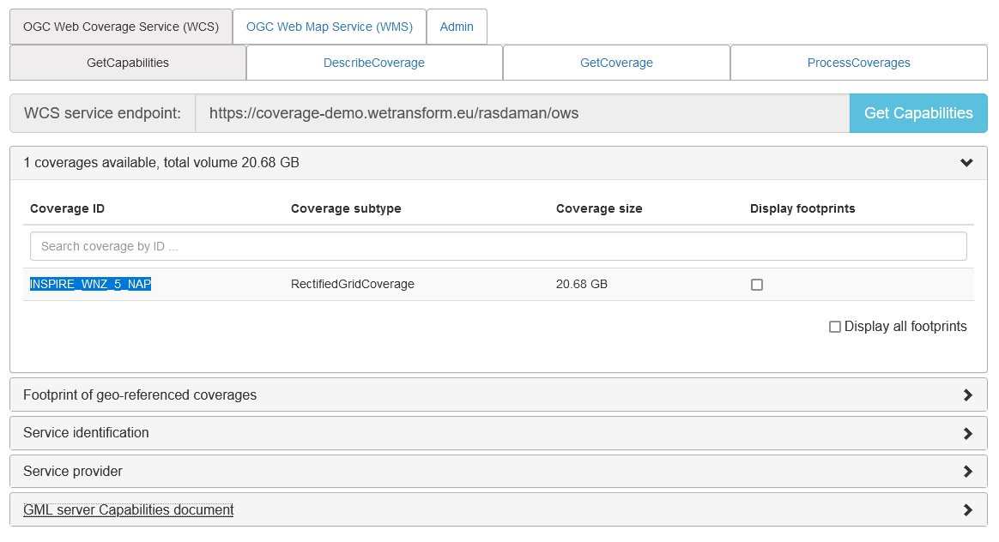
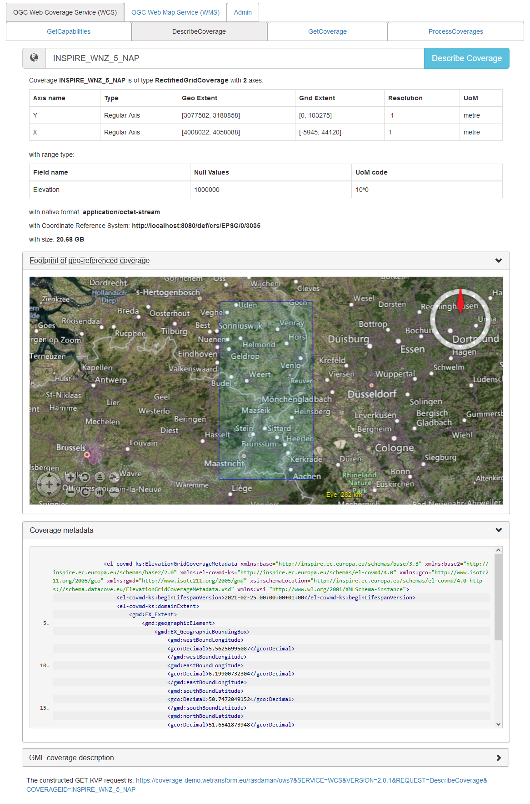

# Using Coverages

- [OGC Web Services](./UsingCoverages.md#ogc-web-services)
- [WCS Requests](./UsingCoverages.md#wcs-requests)
  - [GetCapabilities](./UsingCoverages.md#getcapabilities)
  - [DescribeCoverage](./UsingCoverages.md#describecoverage)
  - [GetCoverage](./UsingCoverages.md#getcoverage)


## OGC Web Services
OGC Web Services (OWS) compose a suite of related web services, tailored for the provision of various types of OGC data models. The following list shows the core OWS:

- [Web Map Service (WMS)](https://www.ogc.org/standards/wms): provides a simple HTTP interface for requesting geo-registered map images from one or more distributed geospatial databases. 
- [Web Feature Service (WFS)](https://www.ogc.org/standards/wfs): offers direct fine-grained access to geographic information at the feature and feature property level.
- [Web Coverage Service (WCS)](https://www.ogc.org/standards/wcs): offers multi-dimensional coverage data for access over the Internet. 
- [Web Coverage Processing Service (WCPS)](https://www.ogc.org/standards/wcps): defines a protocol-independent language for the extraction, processing, and analysis of multi-dimensional coverages representing sensor, image, or statistics data.
- [Sensor Observation Service (SOS)](https://www.ogc.org/standards/sos):  allows querying observations, sensor metadata, as well as representations of observed features. Further, this standard defines means to register new sensors and to remove existing ones. Also, it defines operations to insert new sensor observations. 
- [Catalogue Service Web (CSW)](https://www.ogc.org/standards/cat): support the ability to publish and search collections of descriptive information (metadata) for data, services, and related information objects. 

## WCS Requests
In the following sections, we desribe the main WCS requests.

### GetCapabilities
The GetCapabilities request returns basic information about the service endpoint being interrogated. This request is common to all OWS.

**Request Structure:**

```
http://{WCS Endpoint}/ows?
    SERVICE=WCS& 
    VERSION=2.0.1&
    REQUEST=GetCapabilities
```

Example Request:

https://coverage-demo.wetransform.eu/rasdaman/ows?&SERVICE=WCS&VERSION=2.0.1&REQUEST=GetCapabilities

**Response**

The [**GetCapabilities Response**](GetCapabilitiesResponse.xml) us usually returned in XML encoding. For easier readability, rasdaman endpoint provides a simple GUI that displays all relevant information from the XML response in a human readable manner.



### DescribeCoverage
The DescribeCoverage request returns indepth information on a specific coverage provided by the service endpoint

**Request Structure:**

```
Request Structure:
    https://{WCS Endpoint}/ows?
    SERVICE=WCS&
    VERSION=2.0.1&
    REQUEST=DescribeCoverage&
    COVERAGEID={CoverageID}
```

Example Request:

https://coverage-demo.wetransform.eu/rasdaman/ows?&SERVICE=WCS&VERSION=2.0.1&REQUEST=DescribeCoverage&COVERAGEID=INSPIRE_WNZ_5_NAP


**Response**

The [**DescribeCoverage Response**](GetCapabilitiesResponse.xml) provides indepth information on a specific coverage, includes:
- Domain: area and resolution for which data is provided, the grid
- RangeType: information on the values being provided
- Coverage Metadata Element content (XML Snippet)



### GetCoverage
The GetCoverage request is used to access the Coverage Range (the actual VALUES for the individual grid points). These values can be provided in various formats, whereby the full list of formats is provided in the [**GetCapabilities Response**](GetCapabilitiesResponse.xml). 

Request Structure:

```
https://{WCS Endpoint}/ows?
    SERVICE=WCS&
    VERSION=2.0.1&
    REQUEST=GetCoverage&
    COVERAGEID={CoverageID}&
    FORMAT={responseFormat}	&
    SUBSET=Y({MinY},{MaxY})&
    SUBSET=X({MinX},{MaxX})
```

_Note that the subset parameters are optional._

Example Request:

https://coverage-demo.wetransform.eu/rasdaman/ows?&SERVICE=WCS&VERSION=2.0.1&REQUEST=GetCoverage&COVERAGEID=INSPIRE_WNZ_5_NAP&SUBSET=Y(3117600,3124600)&SUBSET=X(4024000,4031000)&FORMAT=image/tiff

## Integrating in GIS
At present, most GIS tools do not support WCS, and those that do only support version 1.0, whereas INSPIRE mandates the use of at least version 2.0. However, this is not that great of an issue, as all GIS tools can access at least on of the many response formats offered by WCS, e.g., TIFF. The required data can be accessed as described above, either through the creation of a WCS request URL specifying what portion of the coverage to provide in what format, or interactively via the GUI. The resulting coverage must then be stored locally, and accessed via the GIS tool of choice.


