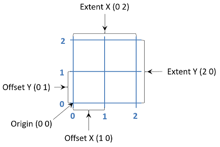

# Coverages in a Nutshell

While a lot of “normal” spatial data relies on points, lines and polygons for the representation of spatial objects, this approach doesn’t work when providing data over a larger area where the values vary across the area. A nice example of this is Elevation, what “normal” spatial feature would one use to represent the varying elevation values across a country? While one could serve lots of individual points or little polygons, one for each measurement point, such an approach becomes very inefficient when dealing with high resolution data, e.g. an elevation point every 5m.

Coverage models take a different approach, relying on the regularity of the positioning of the measurement points. If we know that the measurement points are located on a rectilinear grid, we don’t need to list every point individually! Instead, all we need to define the grid representing the area for which we wish to provide data are the origin, offset and extent. This grid is known as the Domain of the Coverage. In the Range of the Coverage, we provide a value for each grid point described in the Domain. The order in which these values are provided is specified in the CoverageFunction (are the rows scanned  horizontally or vertically).


Information on the content of the Coverage Range can be provided in the Range Type Element. Additional metadata can be provided as required. In UML, the abstract representation of a Coverage is as follows.


## Coverage Domain

The Coverage Domain defines a regular grid over the area for which data is to be provided. In order to define this grid, one must specify the following values:
- The origin: a point from which we start our grid
- 2 offset vectors: these are usually expressed as E(ast) and N(orth) or X and Y
- Extent: how many steps do we take in each direction




## Coverage Domain Example

Domain Values:
- Origin: (686000 5634300)
- Offset X: (0, 1)
- Offset Y: (1, 0)
- Extent X: 2
- Extent Y: 2

These values lead to the following grid:


One can also express the Coverage Domain in XML:

```
<gml:domainSet>
	<gml:RectifiedGrid dimension="2" gml:id="INSPIRE_WNZ_5_NAP-grid">
		<gml:limits>
			<gml:GridEnvelope>
				<gml:low>0 0</gml:low>
				<gml:high>2 2</gml:high>
			</gml:GridEnvelope>
		</gml:limits>
		<gml:axisLabels>Y X</gml:axisLabels>
		<gml:origin>
			<gml:Point gml:id="INSPIRE_WNZ_5_NAP-point" srsName="http://localhost:8080/def/crs/EPSG/0/3043">
				<gml:pos>686000 5634300</gml:pos>
			</gml:Point>
		</gml:origin>
		<gml:offsetVector srsName="http://localhost:8080/def/crs/EPSG/0/3035">1 0</gml:offsetVector>
		<gml:offsetVector srsName="http://localhost:8080/def/crs/EPSG/0/3035">0 1</gml:offsetVector>
	</gml:RectifiedGrid>
</gml:domainSet>
```

## Range Type
The Range Type of the coverage indicates what the values provided in the Range represent. When providing elevation data, the vertical CRS, together with the unit of measurement utilized by this vertical component, should be provided. While INSPIRE originally foresaw the use of EVRF2007 height - EPSG:5621, this has now been superceeded by EVRF2019 mean-tide height - EPSG:9390. This CRS has the unit of measurement 'm' and direction 'up'.

In XML, the rangeType is encoded as follows:

```
<gmlcov:rangeType>
    <swe:DataRecord>
        <swe:field name="Elevation">
            <swe:Quantity definition="epsg::9390" axisID="Z">
                <swe:label>Elevation</swe:label>
                <swe:description>EVRF2019 mean-tide height - EPSG:9390</swe:description>
                <swe:nilValues>
                    <swe:NilValues>
                        <swe:nilValue reason="">1000000.0</swe:nilValue>
                    </swe:NilValues>
                </swe:nilValues>
                <swe:uom code="m"/>
            </swe:Quantity>
        </swe:field>
    </swe:DataRecord>
</gmlcov:rangeType>
```

## Coverage Range
Once the Domain has been defined in this manner, one can provide the values for the individual points defined in the domain as a simple list, the Range in Coverage-Speak. If you take a step back, you see that this is actually getting close to RDF or functional logic, with the Coverage providing a function on the Domain and returning the Range as the result.
## Range Example
In the diagram below, we show the values within the individual coverage points:


 
In actual encoding, the Coverage RangeSet would just provide these values as a simple list, as the locations are already defined by the Domain:

```
<gml:rangeSet>
	<gml:DataBlock>
	<gml:rangeParameters/>
		<gml:tupleList cs=" " ts=",">
			6.2, 7.1, 7.3, 5.4, 6.8, 7.4, 5.1, 5.7, 5.9
		</gml:tupleList>
	</gml:DataBlock>
</gml:rangeSet>
```

## Coverage Function

How the actual mapping between Domain Grid points and Range values happens is defined in the coverage function, that is returned together with the coverage. The sequenceRule indicates the order in which the axes are scanned to deliver the values, while the startPoint indicates where within the entire coverage the provided section begins.

```
<gml:coverageFunction>
	<gml:GridFunction>
		<gml:sequenceRule axisOrder="+1 +2">Linear</gml:sequenceRule>
		<gml:startPoint>0 0</gml:startPoint>
	</gml:GridFunction>
</gml:coverageFunction>
```
