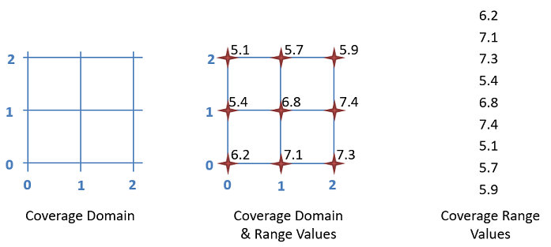

# Coverages in a Nutshell

While a lot of “normal” spatial data relies on points, lines and polygons for the representation of spatial objects, this approach doesn’t work when providing data over a larger area where the values vary across the area. A nice example of this is Elevation, what “normal” spatial feature would one use to represent the varying elevation values across a country? While one could serve lots of individual points or little polygons, one for each measurement point, such an approach becomes very inefficient when dealing with high resolution data, e.g. an elevation point every 5m.

Coverage models take a different approach, relying on the regularity of the positioning of the measurement points. If we know that the measurement points are located on a rectilinear grid, we don’t need to list every point individually! Instead, all we need to define the grid representing the area for which we wish to provide data are the origin, offset and extent. This grid is known as the Domain of the Coverage. In the Range of the Coverage, we provide a value for each grid point described in the Domain. The order in which these values are provided is specified in the CoverageFunction (are the rows scanned  horizontally or vertically).




## Coverage Domain

XXX

Instead, all we need to define the basic grid are:
- The origin: a point from which we start our grid
- 2 offset vectors: these are usually expressed as E(ast) and N(orth) or X and Y
- Extent: how many steps do we take in each direction


## Coverage Domain Example

Domain Values:
- Origin: (686000 5634300)
- Offset X: (0, 1)
- Offset Y: (1, 0)
- Extent X: 2
- Extent Y: 2

```
        <gml:domainSet>
            <gml:RectifiedGrid dimension="2" gml:id="INSPIRE_WNZ_5_NAP-grid">
                <gml:limits>
                    <gml:GridEnvelope>
                        <gml:low>0 0</gml:low>
                        <gml:high>2 2</gml:high>
                    </gml:GridEnvelope>
                </gml:limits>
                <gml:axisLabels>Y X</gml:axisLabels>
                <gml:origin>
                    <gml:Point gml:id="INSPIRE_WNZ_5_NAP-point" srsName="http://localhost:8080/def/crs/EPSG/0/3043">
                        <gml:pos>686000 5634300</gml:pos>
                    </gml:Point>
                </gml:origin>
                <gml:offsetVector srsName="http://localhost:8080/def/crs/EPSG/0/3035">1 0</gml:offsetVector>
                <gml:offsetVector srsName="http://localhost:8080/def/crs/EPSG/0/3035">0 1</gml:offsetVector>
            </gml:RectifiedGrid>
        </gml:domainSet>
```


